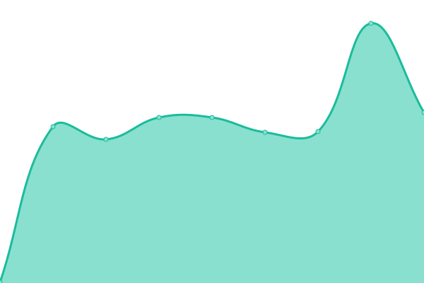

# [📈 Live Status](https://cristdulcey.github.io/upptime-loducode): <!--live status--> **🟩 All systems operational**

This repository contains the open-source uptime monitor and status page for [cristdulcey](https://cristdulcey.github.io/upptime-loducode), powered by [Upptime](https://github.com/upptime/upptime).

With [Upptime](https://upptime.js.org), you can get your own unlimited and free uptime monitor and status page, powered entirely by a GitHub repository. We use [Issues](https://github.com/cristdulcey/upptime-loducode/issues) as incident reports, [Actions](https://github.com/cristdulcey/upptime-loducode/actions) as uptime monitors, and [Pages](https://cristdulcey.github.io/upptime-loducode) for the status page.

<!--start: status pages-->
<!-- This summary is generated by Upptime (https://github.com/upptime/upptime) -->
<!-- Do not edit this manually, your changes will be overwritten -->
<!-- prettier-ignore -->
| URL | Status | History | Response Time | Uptime |
| --- | ------ | ------- | ------------- | ------ |
|  [Loducode](https://loducode.com/) | 🟩 Up | [loducode.yml](https://github.com/cristdulcey/upptime-loducode/commits/HEAD/history/loducode.yml) | 

 639ms
     
 | 

<a href="https://cristdulcey.github.io/upptime-loducode/history/loducode">100.00%</a>
    

|  [AXA](https://axacolpatriabot.com/69b16986-ff63-11ea-adc1-0242ac120002/) | 🟩 Up | [axa.yml](https://github.com/cristdulcey/upptime-loducode/commits/HEAD/history/axa.yml) | 

 166ms
     
 | 

<a href="https://cristdulcey.github.io/upptime-loducode/history/axa">100.00%</a>
    

|  [Pasmo dev](https://app.holaubi.org/) | 🟩 Up | [pasmo-dev.yml](https://github.com/cristdulcey/upptime-loducode/commits/HEAD/history/pasmo-dev.yml) | 

 367ms
     
 | 

<a href="https://cristdulcey.github.io/upptime-loducode/history/pasmo-dev">99.40%</a>
    

|  [Pasmo pro](https://chatbot.holaubi.org/) | 🟩 Up | [pasmo-pro.yml](https://github.com/cristdulcey/upptime-loducode/commits/HEAD/history/pasmo-pro.yml) | 

 4022ms
     
 | 

<a href="https://cristdulcey.github.io/upptime-loducode/history/pasmo-pro">51.63%</a>
    

|  [KOZ lands Dev](https://kingdom-of-zoe.loducode.com/es/lands/) | 🟩 Up | [koz-lands-dev.yml](https://github.com/cristdulcey/upptime-loducode/commits/HEAD/history/koz-lands-dev.yml) | 

 485ms
     
 | 

<a href="https://cristdulcey.github.io/upptime-loducode/history/koz-lands-dev">100.00%</a>
    

|  [KOZ lands Prodution](https://sale.kingdomofzoe.app/es/lands/) | 🟩 Up | [koz-lands-prodution.yml](https://github.com/cristdulcey/upptime-loducode/commits/HEAD/history/koz-lands-prodution.yml) | 

 551ms
     
 | 

<a href="https://cristdulcey.github.io/upptime-loducode/history/koz-lands-prodution">100.00%</a>
    

|  [Mi pasaje](https://mipasaje.ec/es/) | 🟩 Up | [mi-pasaje.yml](https://github.com/cristdulcey/upptime-loducode/commits/HEAD/history/mi-pasaje.yml) | 

 672ms
     
 | 

<a href="https://cristdulcey.github.io/upptime-loducode/history/mi-pasaje">100.00%</a>
    

|  [Tipsco](https://tipsco.com/es/products/) | 🟩 Up | [tipsco.yml](https://github.com/cristdulcey/upptime-loducode/commits/HEAD/history/tipsco.yml) | 

 302ms
     
 | 

<a href="https://cristdulcey.github.io/upptime-loducode/history/tipsco">100.00%</a>
    

|  [Tipsco dev](http://3.145.1.238:30003/es/) | 🟩 Up | [tipsco-dev.yml](https://github.com/cristdulcey/upptime-loducode/commits/HEAD/history/tipsco-dev.yml) | 

 238ms
     
 | 

<a href="https://cristdulcey.github.io/upptime-loducode/history/tipsco-dev">100.00%</a>
    

|  [Vault loducode](https://vault.loducode.com/ui/vault/auth/) | 🟩 Up | [vault-loducode.yml](https://github.com/cristdulcey/upptime-loducode/commits/HEAD/history/vault-loducode.yml) | 

 172ms
     
 | 

<a href="https://cristdulcey.github.io/upptime-loducode/history/vault-loducode">100.00%</a>
    

|  [Plikis](https://plikis.app/es/admin/) | 🟩 Up | [plikis.yml](https://github.com/cristdulcey/upptime-loducode/commits/HEAD/history/plikis.yml) | 

 291ms
     
 | 

<a href="https://cristdulcey.github.io/upptime-loducode/history/plikis">100.00%</a>
    

|  [Stereo picnic](https://stereo-picnic.loducode.com/es/nfts/) | 🟩 Up | [stereo-picnic.yml](https://github.com/cristdulcey/upptime-loducode/commits/HEAD/history/stereo-picnic.yml) | 

 219ms
     
 | 

<a href="https://cristdulcey.github.io/upptime-loducode/history/stereo-picnic">100.00%</a>
    

<!--end: status pages-->

[**Visit our status website →**](https://cristdulcey.github.io/upptime-loducode)

## 📄 License

- Powered by: [Upptime](https://github.com/upptime/upptime)
- Code: [MIT](./LICENSE) © [cristdulcey](https://cristdulcey.github.io/upptime-loducode)
- Data in the `./history` directory: [Open Database License](https://opendatacommons.org/licenses/odbl/1-0/)
